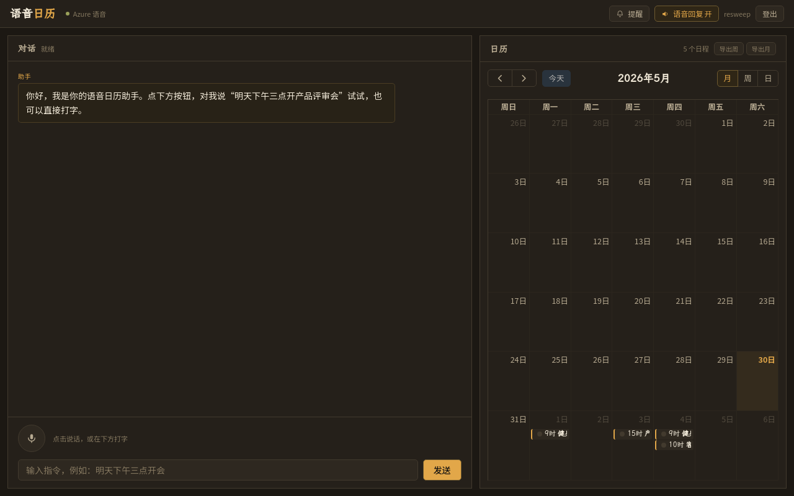

# 语音日历 · Voice Calendar

> 七牛云 × XEngineer 暑期实训营 · 题目一作品
> 以**语音交互为核心**的日历管理工具——边走路、开车、做饭时，一句话搞定加 / 删 / 查 / 改日程。

- **在线试用**：https://voice.qiniu.zdwktlj.top
- **演示视频**：[点击播放 · 48 秒](https://voice.qiniu.zdwktlj.top/demo/voice-calendar-demo.mp4)（自然语言建事件 → 周视图 → 冲突检测 → 接受建议）
- **架构文档**：[docs/ARCHITECTURE.md](docs/ARCHITECTURE.md)



> 提示：在线 Demo 用文字输入框即可体验完整流程；语音功能需在 HTTPS 页面授权麦克风。

## 为什么做这个

看屏幕日历视图反人类——"明天有啥安排"一句话问出来，比扫屏幕快得多。
开车、做饭手不空时想加日程，老人 / 视障用户对图形界面不友好。
语音交互不是"加个录音按钮"，而是**准确识别 + 听懂人话 + 语音回应**的完整对话。

## 核心特性

- **Azure 工业级中文语音**：用 Azure Speech 而非识别率不佳的浏览器 Web Speech API，中文 ASR 显著更准（[选型理由](docs/SPEECH_CHOICE.md)）
- **真语音闭环**：不只语音输入，系统还语音回应"已添加，明天15点的产品评审会"——TTS 对话闭环
- **自然中文时间解析**：听懂"下周三""每周一三五""三天后下午三点""五月二十号"等 30+ 表达式，循环日程自动展开（[实现](docs/TIME_PARSING.md)）
- **歧义对话澄清**：说"把那个会删了"且有多个会时，主动列候选反问"要删哪一个？"
- **冲突检测与建议**：加日程撞车时不只报错，给出"和你的客户对接冲突，要不要改到16点？"
- **日程提醒**：到点浏览器通知
- **用户账户**：用户名+密码(bcrypt)+JWT 登录，日程按用户持久化、跨设备/刷新可见
- **多轮规划 agent**：给一个目标(如"安排下周三场论文复习，避开已有的会")，自动拆成多个日程、避开冲突、列出计划待你确认
- **真实操作——.ics 日历导出/订阅**：说"把本周日程导出"，生成标准 .ics 文件；复制 webcal:// 链接订阅到手机/Google/Apple Calendar，语音加的日程真同步到真实日历应用

## 快速开始

### 在线
直接打开 https://voice.qiniu.zdwktlj.top

### 本地后端
```bash
cd backend
python3 -m venv .venv && source .venv/bin/activate
pip install -r requirements.txt
cp .env.example .env   # 填入 AZURE_SPEECH_KEY / DEEPSEEK_API_KEY
uvicorn app.main:app --reload --port 8081
```

### 本地前端
```bash
cd frontend
npm install && npm run dev   # 访问 http://localhost:5173
```

命令行体验完整 NLU 链路（无需前端）：
```bash
cd backend && python scripts/demo_cli.py
```

部署见 [docs/DEPLOY.md](docs/DEPLOY.md)。

## 系统架构

```
语音输入 ─> Azure ASR(zh-CN) ─> 意图解析(DeepSeek) ─> 时间解析(规则三层) ─> 冲突检测 ─> SQLite
   ^                                                                              │
   └────────── 语音回应 <─ Azure TTS <─ 回应文案生成 <──────────────────────────────┘
```

详见 [docs/ARCHITECTURE.md](docs/ARCHITECTURE.md)（含 4 张 mermaid 图与时序图）。

技术栈：FastAPI · SQLAlchemy · Azure Speech · DeepSeek(OpenAI 兼容) · React + Vite + Tailwind · FullCalendar · Caddy。

## 设计文档

- 语音方案选型：[docs/SPEECH_CHOICE.md](docs/SPEECH_CHOICE.md)
- 中文时间解析：[docs/TIME_PARSING.md](docs/TIME_PARSING.md)
- 扩展方向：[docs/FUTURE_WORK.md](docs/FUTURE_WORK.md)
- 决策与踩坑总账：[docs/复盘.md](docs/复盘.md)

## 引用代码声明

本项目为本次比赛**从零原创**，未复用任何过往项目代码。使用的第三方开源库（均为生态标准件）：

- 后端：FastAPI、SQLAlchemy、uvicorn、httpx、dateparser、openai-python、azure-cognitiveservices-speech
- 前端：React、Vite、Tailwind CSS、FullCalendar、microsoft-cognitiveservices-speech-sdk

**自己原创的核心**：意图解析 prompt 与编排、中文时间解析规则引擎（三层兜底）、冲突检测与建议算法、两级歧义澄清、LLM 抽象层与 fallback、语音 token 签发与闭环编排、整套前端 UI。

## AI 协作声明

本项目通过 **Claude Code** 辅助开发，全程规范 PR 工作流（45+ 个小 PR，每个含功能/思路/测试说明）。
完整的 Prompt 思路、关键技术决策、AI 出错与人工修正实例，记录在 [docs/复盘.md](docs/复盘.md)。
代码经过人工审阅、单元测试（后端 153 项全过）与真实环境联调定型。

## 开源协议

[MIT](LICENSE)

## 作者

tljcpa
