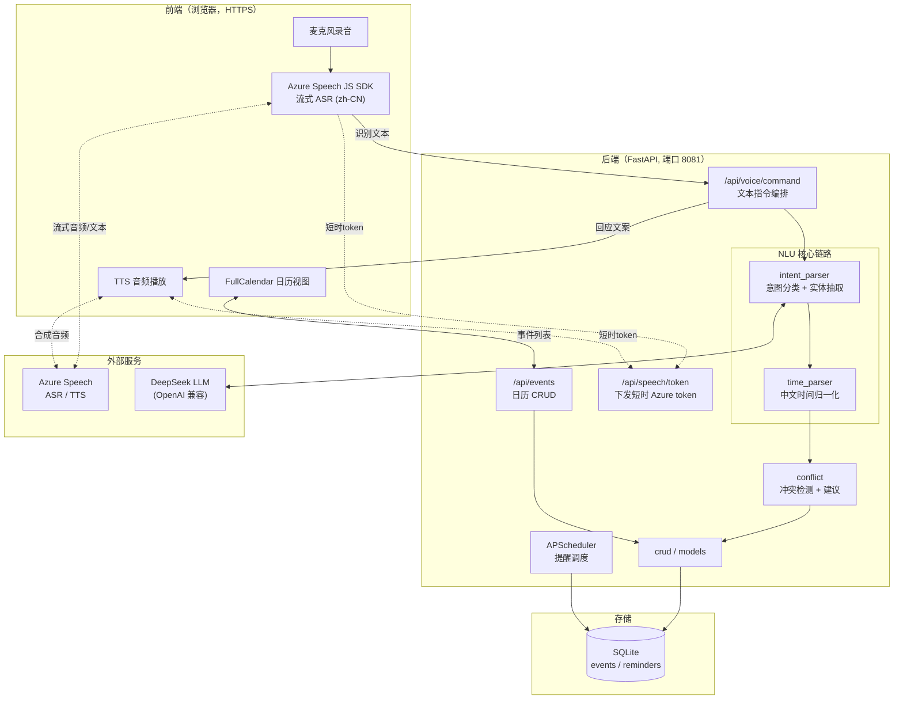
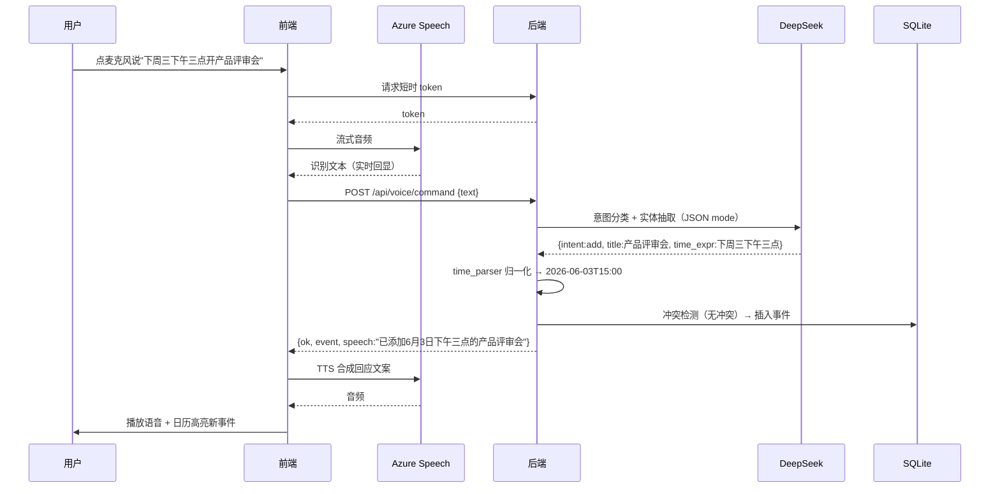
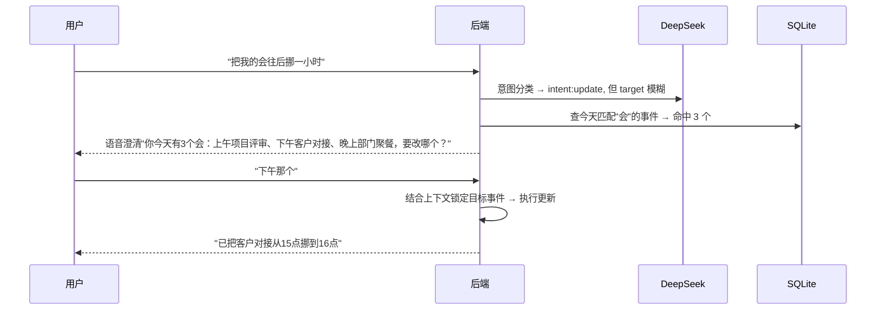
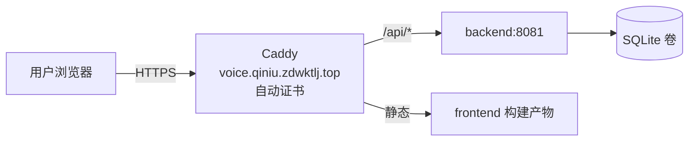

# 系统架构

> 本文档是语音日历项目的详细架构说明，指导后续所有功能 PR 的实现。
> 关键技术选型的"为什么"记录在 [复盘.md](复盘.md) 的 D-XX 决策日志，本文档侧重"是什么/怎么连"。

## 1. 设计目标

题目要求"以**语音交互为核心**"，因此架构的第一性原则是：

1. **语音是主交互，不是输入手段之一**——用户全程可以不看屏幕完成"加/删/查"日程，系统用 TTS 语音回应，形成对话闭环。
2. **中文识别要"能用"**——用工业级 Azure Speech 而非浏览器 Web Speech API（识别率、兼容性差距见 [D-01](复盘.md)）。
3. **自然语言优先**——用户说人话（"下周三下午开会"），不背指令格式；时间表达由 LLM + dateparser + 规则三层兜底解析。
4. **对话式容错**——意图模糊时主动澄清而非报错；加日程时检测冲突并给建议。

## 2. 总体架构

## 3. 语音管线：为什么 ASR/TTS 放在浏览器，但 key 在后端

**核心安全设计**：Azure Speech 的订阅 key 绝不下发到浏览器。后端 `/api/speech/token` 用 key 向 Azure 换取**短时令牌**（约 10 分钟有效），前端拿令牌直连 Azure。

- **为什么 ASR 在浏览器**：浏览器用 Azure JS SDK 直连，省去"音频上传到后端再转发 Azure"的一跳，**流式识别延迟更低**，能实时显示"正在识别的文字"，demo 观感好。
- **为什么不暴露 key**：key 一旦进前端 JS 即泄露，任何人可盗刷 F0 配额。短时令牌即使泄露也很快失效，且不可反推 key。这是 Azure 官方推荐的浏览器集成方式。
- **后端 `speech.py` 仍保留服务端 ASR/TTS 能力**（PR4）：用于命令行验证脚本、自动化测试、以及浏览器 SDK 不可用时的降级路径。
- **TTS 同理**：前端用令牌直接调 Azure TTS 合成并播放，形成"说完即听到回应"的闭环。

## 4. 关键数据流

### 4.1 语音添加事件（主路径）

### 4.2 歧义澄清（如"改一下我的会"）

## 5. 模块职责

| 模块 | 文件 | 引入 PR | 职责 |
|---|---|---|---|
| 配置 | `app/config.py` | PR1 | 集中读取环境变量，凭证不入 git |
| 应用入口 | `app/main.py` | PR1 | FastAPI 工厂、路由装配、CORS、健康检查 |
| LLM 抽象层 | `app/llm_provider.py` | PR3 | 统一封装 DeepSeek（默认）/ Azure OpenAI（备用），JSON mode |
| 语音服务 | `app/speech.py` | PR4 | 后端 ASR/TTS + 短时 token 签发 |
| 意图解析 | `app/intent_parser.py` | PR5 | 意图分类（add/del/view/update/clarify）+ 实体抽取，严格 JSON schema |
| 时间解析 | `app/time_parser.py` | PR6 | 中文时间表达 → ISO8601，三层兜底 |
| 数据模型 | `app/models.py` | PR7 | 事件 / 提醒 ORM 模型 |
| 数据访问 | `app/crud.py` | PR7 | 事件增删改查 |
| 冲突检测 | `app/conflict.py` | PR8 | 时间区间重叠判断 + 调度建议生成 |
| API 路由 | `app/api/*.py` | PR9 | REST + WebSocket（流式 ASR 可选） |
| 提醒调度 | `app/scheduler.py` | PR14 | APScheduler + SQLite jobstore 持久化 |

## 6. 技术栈与理由

| 层 | 选型 | 理由（详见复盘 D-XX） |
|---|---|---|
| 后端 | Python 3.11 + FastAPI | async + WebSocket 友好，流式语音用得上 |
| 语音 | Azure Speech（前端 JS SDK 为主，后端 SDK 兜底） | 工业级中文 ASR/TTS，已开 F0 免费层（D-01） |
| LLM | DeepSeek（默认）+ Azure OpenAI（备用），openai-python | OpenAI 兼容协议，一套客户端切换后端 |
| 时间 | dateparser + 自写中文规则补丁 | dateparser 中文覆盖有限，需补"下周三/每周一三五"等（D-04） |
| 前端 | React + Vite + Tailwind + shadcn/ui | 现代、好看、3 天可交付，demo 观感优先 |
| 日历组件 | FullCalendar | 不自撸日历视图（D-08 待定） |
| 数据库 | SQLite | 部署简单，单文件，够 demo 规模 |
| 提醒 | APScheduler + Web Notifications API | 后端定时 + 前端推送，jobstore 持久化防重启丢任务 |
| 部署 | Docker Compose + Caddy（自动 HTTPS） | 与另两项目隔离，HTTPS 是麦克风权限硬要求 |

**明确不用**：LangChain（套壳，直接用 openai-python 更可控）；不自撸 WebRTC（Azure SDK 浏览器版够用）。

## 7. API 表面（草图，PR9 定稿）

| 方法 | 路径 | 用途 |
|---|---|---|
| GET | `/health` | 探活 + 依赖配置状态（PR1 已有） |
| POST | `/api/speech/token` | 签发浏览器用短时 Azure token |
| POST | `/api/voice/command` | 文本指令 → 意图解析 → 执行 → 返回结果 + 回应文案 |
| GET | `/api/events` | 查询事件（按时间范围） |
| POST | `/api/events` | 创建事件 |
| PATCH | `/api/events/{id}` | 修改事件 |
| DELETE | `/api/events/{id}` | 删除事件 |
| WS | `/ws/asr` | 可选：后端中转的流式 ASR（降级路径） |

## 8. 数据模型（草图，PR7 定稿）

- **event**：id, title, start_at, end_at, location, attendees, note, created_at
- **reminder**：id, event_id, remind_at, channel(browser/email), sent

## 9. 部署拓扑

三项目共用一台 Azure VM（`20.172.25.105`），本项目隔离手段：

- 独立 compose project 名 `voice-calendar`
- 后端独立端口 `8081`
- 独立目录 `/opt/voice-calendar`
- Caddy 按域名 `voice.qiniu.zdwktlj.top` 路由，自动签 Let's Encrypt 证书

## 10. 开发/测试拓扑

本机内存受限（3.8G），故：**本机只做 写代码 / commit / push / 纯单元测试（mock 外部依赖）**；
起服务、前端 dev、真实 LLM/语音/集成测试一律在 Azure VM 上跑（详见复盘 D-12）。
因此所有单元测试必须可脱离真实网络与凭证运行。
